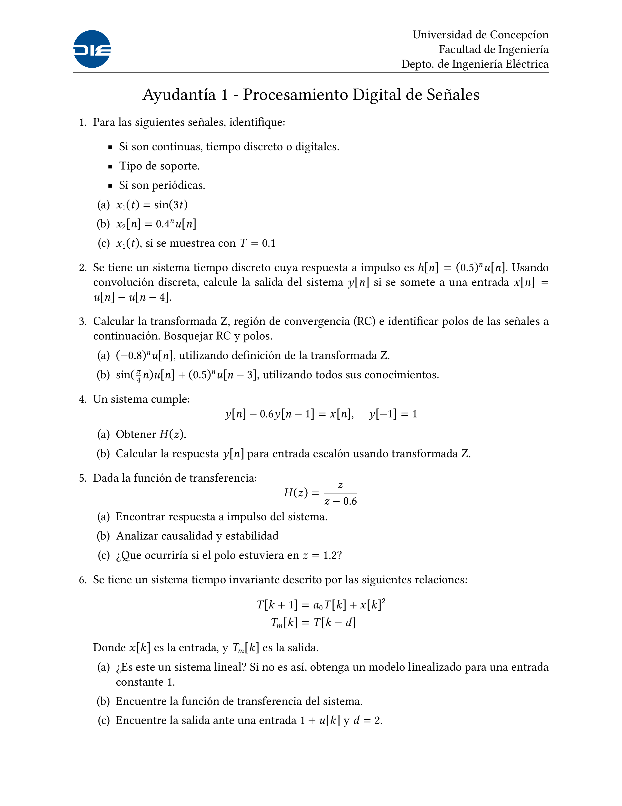
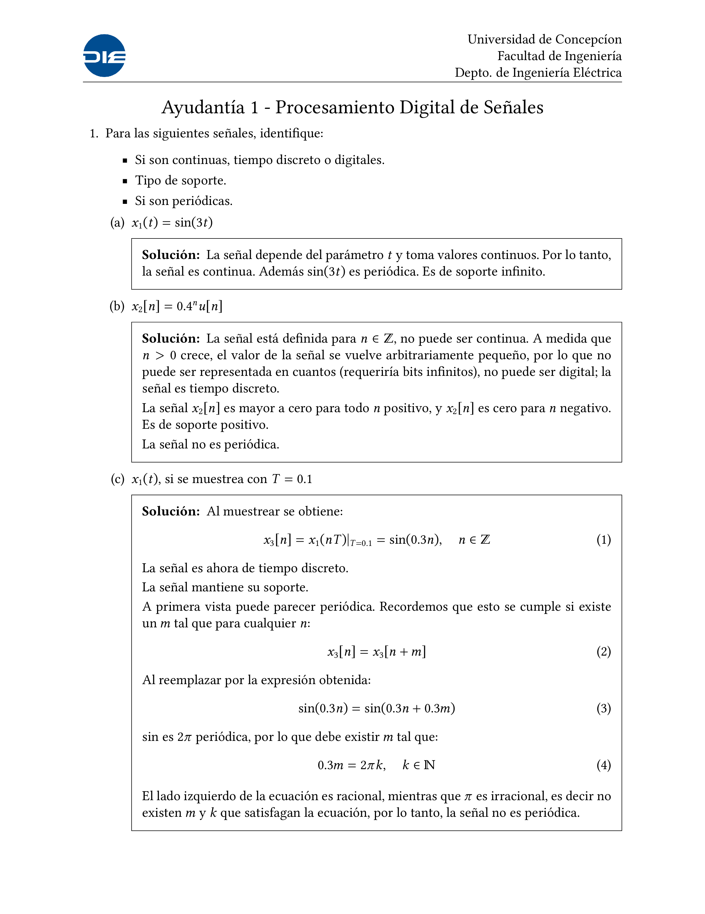

# Ayudantías de Procesmiento Digital de Señales 2025-2

Basadas en [Applied Digital Signal Processing](https://github.com/Devin-WEN/UIUC_ECE_310/blob/main/Applied_Digital_Signal_Processing_%20Theory_and_Practice.pdf)

  
  

## [Ayudantía 1](ayudantia_1/ayudantia_1.pdf)
[Solución](ayudantia_1/ayudantia_1_solucion.pdf)

## [Ayudantía 2](ayudantia_2/ayudantia_2.pdf)
[Solución](ayudantia_2/ayudantia_2_solucion.pdf)

## [Ayudantía 3](ayudantia_3/ayudantia_3.pdf)
[Solución](ayudantia_3/ayudantia_3_solucion.pdf)

## [Ayudantía 4](ayudantia_4/ayudantia_4.pdf)
[Solución](ayudantia_4/ayudantia_4_solucion.pdf)

## [Ayudantía 5](ayudantia_5/ayudantia_5.pdf)
[Solución](ayudantia_5/ayudantia_5_solucion.pdf)

## [Ayudantía 6](ayudantia_6/ayudantia_6.pdf)
[Solución](ayudantia_6/ayudantia_6_solucion.pdf)

## [Ayudantía 7](ayudantia_7/ayudantia_7.pdf)
[Solución](ayudantia_7/ayudantia_7_solucion.pdf)

## [Ayudantía 8](ayudantia_8/ayudantia_8.pdf)
[Solución](ayudantia_8/ayudantia_8_solucion.pdf)

## [Ayudantía 9](ayudantia_9/ayudantia_9.pdf)
[Solución](ayudantia_9/ayudantia_9_solucion.pdf)

## [Ayudantía 10](ayudantia_10/ayudantia_10.pdf)
[Solución](ayudantia_10/ayudantia_10_solucion.pdf)

## [Ayudantía 11](ayudantia_11/ayudantia_11.pdf)
